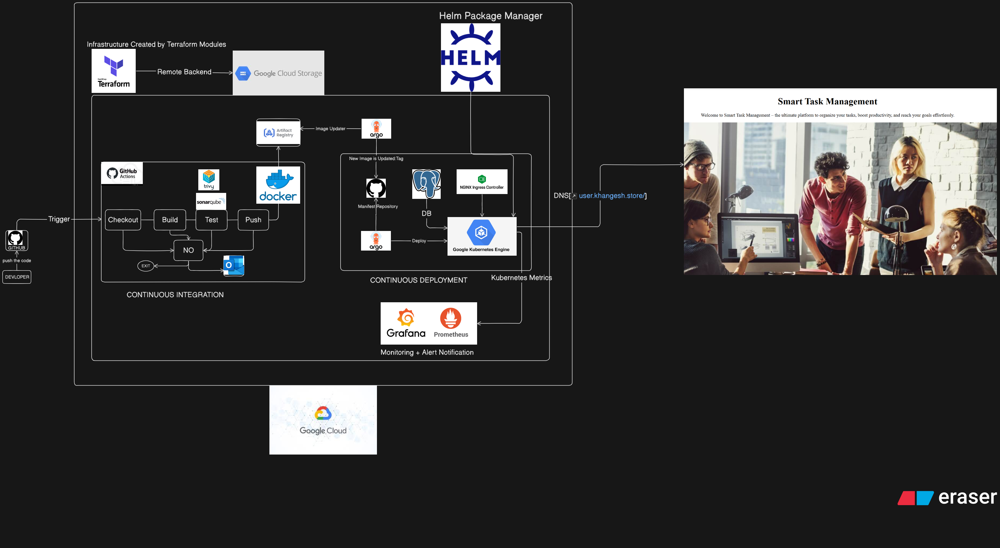
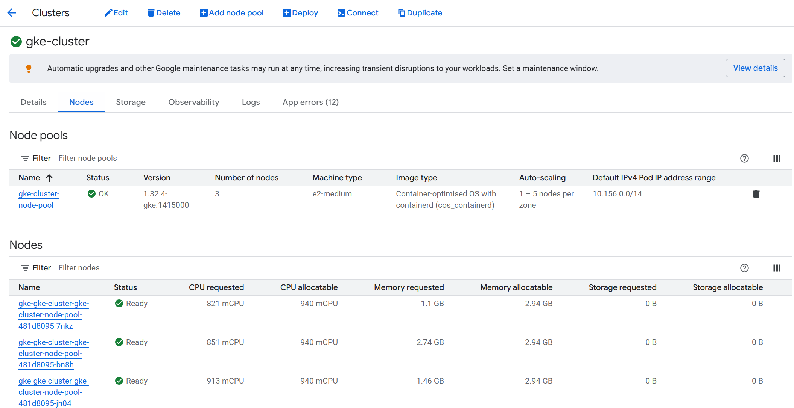
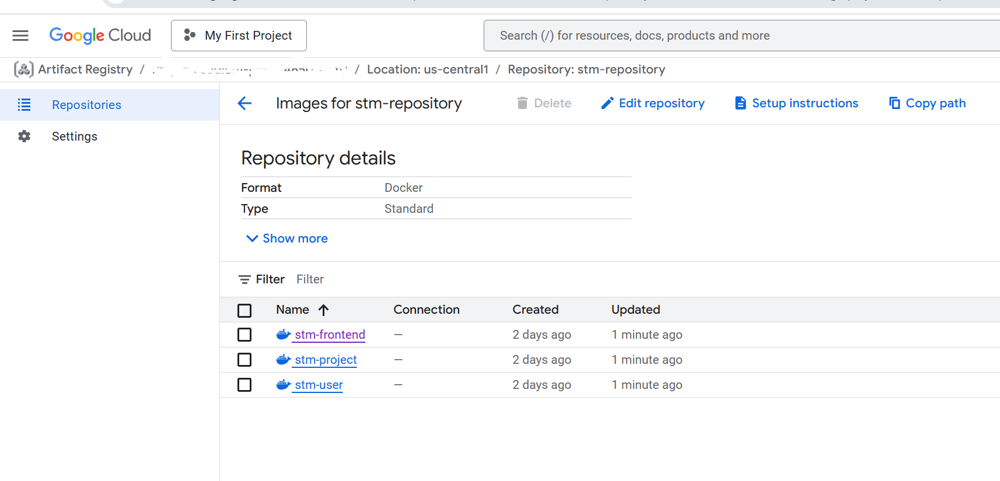
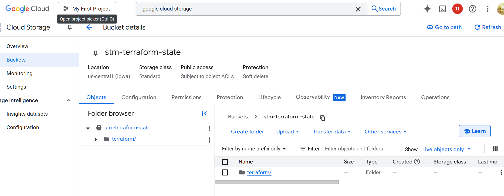
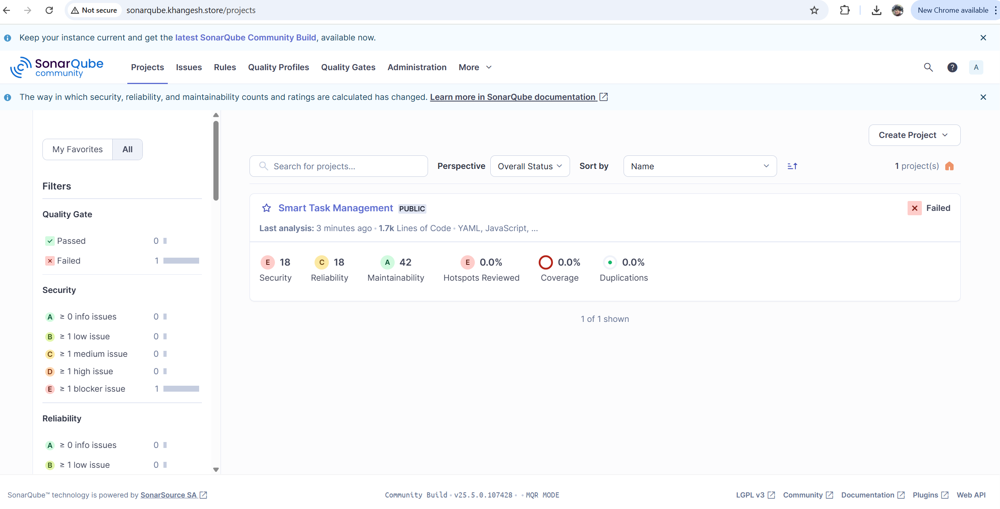
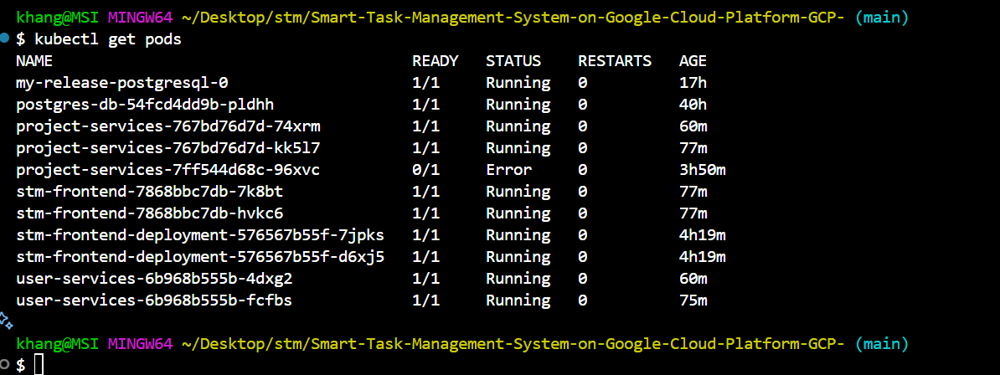
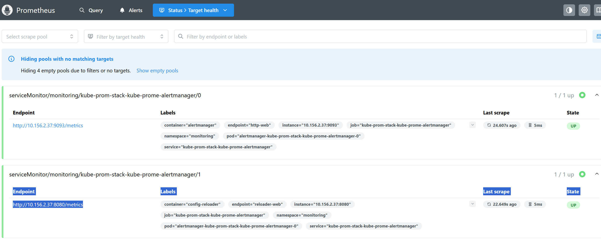
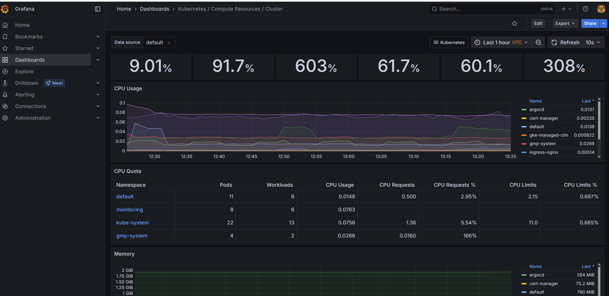
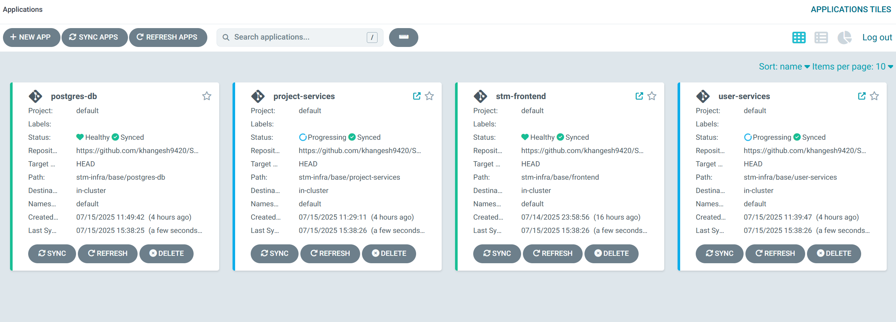

# Smart Task Management System on Google Cloud Platform (GCP) ☕️

A lightweight, cloud-native task/project management application deployed on **Google Cloud Platform (GCP)**. Users can securely register, create projects, manage tasks, and get real-time notifications on task status. Designed with DevSecOps principles, this system uses a robust GitOps pipeline and automated CI/CD processes.

---

## 📊 Key Features

- **User Authentication:** Secure registration and login.
- **Task & Project Management:** Users can create and manage projects, assign tasks, and update status.
- **Notification System:** Email or other notification services on task assignment and completion.
- **Cloud-Native Architecture:** Fully containerized microservices architecture.

---

## 🚀 Architecture Overview














&#x20;     &#x20;

**Cloud Services & Tools:**

- **Google Kubernetes Engine (GKE)**
- **Google Cloud Storage (Terraform state storage)**
- **Artifact Registry (Docker images)**
- **GitHub Actions (CI/CD pipelines)**
- **SonarQube (Static code analysis)**
- **Trivy (Security scanning)**
- **ArgoCD (GitOps continuous delivery)**
- **PostgreSQL (Managed in GKE)**
- **Helm Charts (Kubernetes deployments)**
- **Terraform (Infrastructure as Code)**
- **Prometheus (Monitoring and Alerting)**
- **Grafana (Dashboard Visualization)**

---

## 🧰 Technology Stack

| Layer              | Technologies & Tools                                           |
| ------------------ | -------------------------------------------------------------- |
| **Infrastructure** | Google Cloud, Terraform, GKE, Cloud Storage, Artifact Registry |
| **DevOps**         | GitHub Actions, SonarQube, Trivy, ArgoCD, Helm                 |
| **Monitoring**     | Prometheus, Grafana                                            |
| **Backend**        | REST APIs, PostgreSQL, Docker                                  |
| **Security**       | Static & dynamic scans, secure secret management               |

---

## 📂 Repository Structure

```
.
├── .github/workflows/       # GitHub Actions workflows for CI/CD
├── scripts/                 # Scripts for interconnecting services
├── services/                # All microservices for the application
├── stm-infra/base/          # Base Helm charts and Kubernetes manifests
├── terraform_scripts/       # Terraform modules for infrastructure provisioning
├── STM_DIAGRAM.png          # Architecture diagram image
├── docker-compose.yaml      # Docker Compose file for local development
├── sonar-project.properties # Configuration for SonarQube scanning
├── LICENSE                  # Project license (MIT)
├── README.md                # Project documentation
└── .gitignore               # Git ignored files and folders
```

---

## ✨ Setup Instructions

### 1. Provision Infrastructure

```bash
cd terraform_scripts
terraform init
terraform apply -var="project=YOUR_PROJECT_ID"
```

### 2. Build & Push Docker Images

Automated via GitHub Actions and pushed to Artifact Registry.

### 3. Deploy with ArgoCD

ArgoCD continuously deploys Helm charts stored in the repo:

```bash
helm install smart-task-system ./stm-infra/base -f deploy/values.yaml
```

---

## 🚗 CI/CD Pipeline

- **On PR/Push:**

  - Code linting and build
  - Run unit tests
  - SonarQube analysis
  - Build Docker images
  - Trivy scans for vulnerabilities
  - Push to Artifact Registry

- **On merge to main:**

  - Update Helm chart
  - ArgoCD detects changes and deploys to GKE

---

## 🐛 Local Development

Start services locally using Docker Compose:

```bash
docker-compose up
```

Access API at: `http://localhost:8080`

---

## 🚫 Security & Monitoring

- Static code analysis with **SonarQube**
- Vulnerability scans with **Trivy**
- Helm chart integrity validation
- RBAC and IAM roles for infrastructure security
- **Prometheus** for metrics collection and alerting
- **Grafana** for system dashboards and visual monitoring

---

## 🌐 Contributing

Feel free to fork this repo and submit pull requests. For major changes, please open an issue first.

Contact: [khangeshmatte@gmail.com](mailto\:khangeshmatte@gmail.com)

---

## 📄 License

This project is licensed under the MIT License - see the [LICENSE](LICENSE) file for details.

